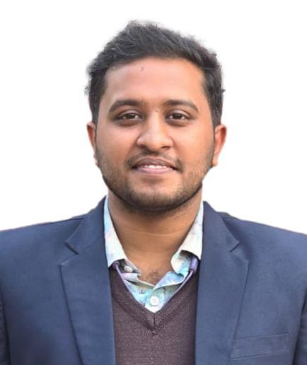

# Udoy Das
M.Sc. Student  
Computer Science  
University of Manitoba  

**[Study Leave]** Lecturer  
East Delta University  

B. Sc. in Computer Science and Engineering,  
Chittagong University of Engineering and Technology  
CGPA: **3.75(with Honors)** / 4.00  

## About Me

    Hi! I am a dedicated and enthusiastic <b>Python</b> developer with a strong interest in <b>machine learning</b> and <b>deep learning</b>. I've also had a long-standing interest in <b>Natural Language Processing</b>, which has been a significant area of my competence. My extensive knowledge of these subjects, as well as practical experience applying their concepts to a variety of projects, have driven my interest for them. I regard myself as a dedicated, punctual, and truthful individual that is always eager to learn and take on new challenges.

> Find my [Academic CV Here](https://drive.google.com/file/d/1eKpA-glT-pq8DNkJcWFnc-GbdMiuvYD1/view?usp=sharing)

<table>
<tr> 
<td><a href="https://github.com/ud0y">GitHub</a></td>
<td><a href="https://www.linkedin.com/in/udoy-das-948356194">LinkedIn</a></td>
<td><a href="https://scholar.google.com/citations?user=VLDlaZ4AAAAJ&hl=en">Google Scholar</a></td>
<td><a href="https://www.researchgate.net/profile/Udoy-Das-2">Research Gate</a></td>
</tr>
</table>

## Updates
<code style="color: #198754"><b>[09-09-26]</b></code> I am excited to begin my M.Sc. journey under the supervision of <a href="https://sadafsaleh.com/">Prof. Dr. Sadaf Salehkalaibar</a>.  
<code style="color: #198754"><b>[21-08-26]</b></code> I moved to Winnipeg, Manitoba, Canada, to begin my graduate studies at the University of Manitoba.  
<code style="color: #198754"><b>[05-06-26]</b></code> <i>Distortion-Aware Image Forgery Detection via Multi-Feature Forensic Fusion and Adaptive Thresholding</i> was accepted for publication.  
<code style="color: #198754"><b>[17-06-25]</b></code> <i>BnVITS: A Voice Cloning Approach for Single Speaker Text-to-Speech</i> was accepted for publication and is available <a href="https://link.springer.com/article/10.1007/s42452-025-07351-0">here</a>.  
<code style="color: #198754"><b>[13-05-25]</b></code> <i>BnVITS: A Voice Cloning Approach for Single Speaker Text-to-Speech</i> was made available as a preprint and submitted for peer review. <a href="https://www.researchsquare.com/article/rs-6530449/latest">View preprint</a>.  
<code style="color: #198754"><b>[25-04-25]</b></code> Submitted my thesis, <i>BnVITS: A Voice Cloning Approach for Single Speaker Text-to-Speech</i>, to the <i>Journal of Discover Applied Sciences</i>.  
<code style="color: #198754"><b>[28-02-25]</b></code> Three shared-task papers were accepted at DravidianLangTech-2025 @ NAACL 2025.  
<code style="color: #198754"><b>[13-02-25]</b></code> <i>Bangla Image Caption Generation Using Vision Transformer (ViT) Based Model</i> was accepted at ECCE 2025.  
<code style="color: #198754"><b>[08-02-25]</b></code> Promoted to Lecturer.  
<code style="color: #198754"><b>[05-10-24]</b></code> Joined East Delta University as a Teaching Assistant.  
<code style="color: #198754"><b>[05-08-24]</b></code> One shared-task paper was accepted at GEM 2024.  
<code style="color: #198754"><b>[11-07-24]</b></code> Two shared-task papers were accepted at ArabicNLP 2024.  
<code style="color: #198754"><b>[25-06-24]</b></code> One shared-task paper was accepted at CheckThat! 2024.  
<code style="color: #198754"><b>[19-03-24]</b></code> One shared-task paper was accepted at SemEval 2024.  
<code style="color: #198754"><b>[11-10-23]</b></code> Two shared-task papers were accepted at the BLP Workshop @ EMNLP 2023.

## Learning Resources

Here are some learning resources I found useful -

* **Books**
    - Deep Learning with Python [[link](https://www.manning.com/books/deep-learning-with-python)]
    - Transformers for Natural Language Processing [[link](https://www.packtpub.com/en-us/product/transformers-for-natural-language-processing-9781803247335)]
    - Natural Language Processing with Transformers [[link](https://www.oreilly.com/library/view/natural-language-processing/9781098136789/)]

* **Blogs**
    - Attention Mechanism [[link](https://jalammar.github.io/visualizing-neural-machine-translation-mechanics-of-seq2seq-models-with-attention/)]
    - The Illustrated Transformer [[link](https://jalammar.github.io/illustrated-transformer/)]
    - The Illustrated BERT [[link](http://jalammar.github.io/illustrated-bert/)]

* **YouTube Playlists**
    - Pytorch Tutorials [[link](https://www.youtube.com/playlist?list=PLqnslRFeH2UrcDBWF5mfPGpqQDSta6VK4)]
    - Deep Learning in Hindi [[link](https://www.youtube.com/playlist?list=PLKnIA16_RmvYuZauWaPlRTC54KxSNLtNn)]
    - Machine Learning for Beginners [[link](https://www.youtube.com/playlist?list=PLeo1K3hjS3uvCeTYTeyfe0-rN5r8zn9rw)]

---

Qoute that inspires

> The best way to predict your future is to create it. - 
*Abraham Lincoln*

---
